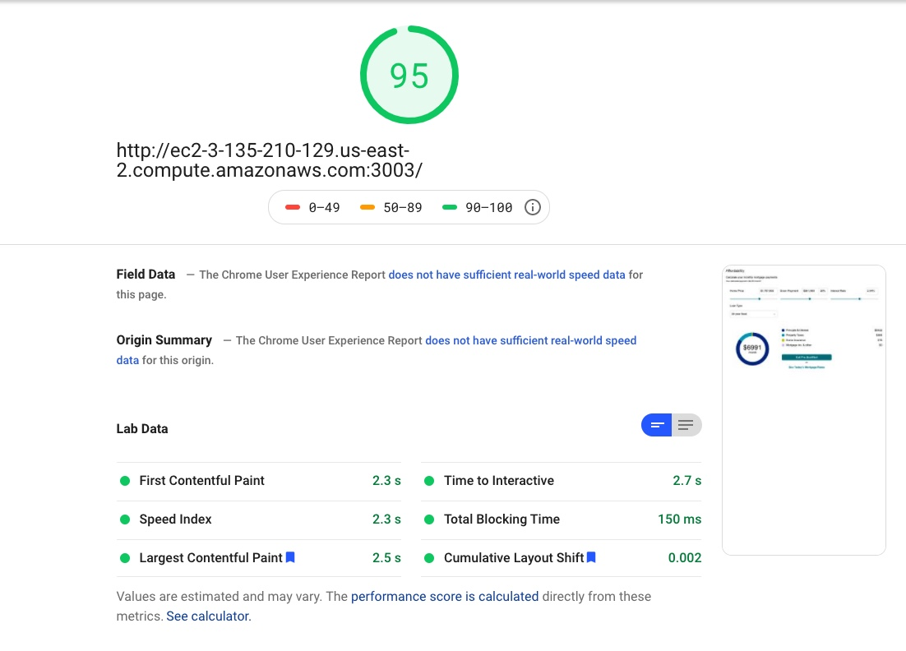
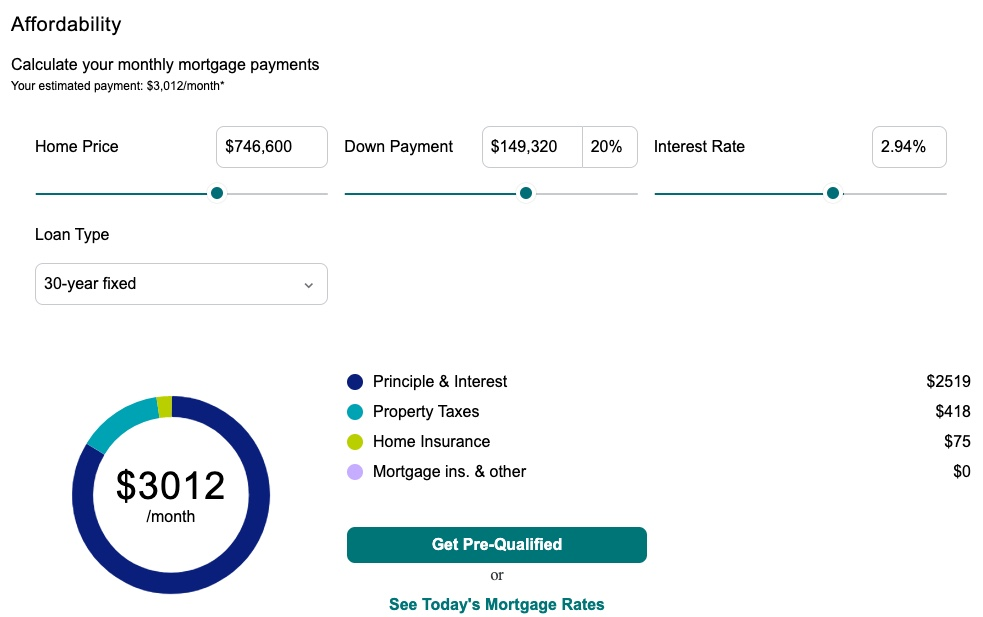

# Project Name

This is an affordability calculator that calculates how much you can afford to spend on a house, and estimates the monthly mortgage payment.
This is done by taking home price, down payment, and interest rate into account.

## Related Projects

  - https://github.com/Archon-Design/similar-homes
  - https://github.com/Archon-Design/PhotoGallery
  - https://github.com/Archon-Design/Local-Review

Page Speed:

snap shot of component:
 

 

## Table of Contents

1. [Usage](#Usage)
1. [Requirements](#requirements)
1. [Development](#development)

## Requirements

- Node v12.18.4

- MongoDB v4.4.0

## Development

### Installing Dependencies

From within the root directory:

npm install : installs packages and dependencies necessary.

npm run start : Will start the server and setup the project.

npm run react-dev : Will run webpack bundler.

npm run seed: seeds the database.

npm run test : runs testing suite and gives a coverage report.
